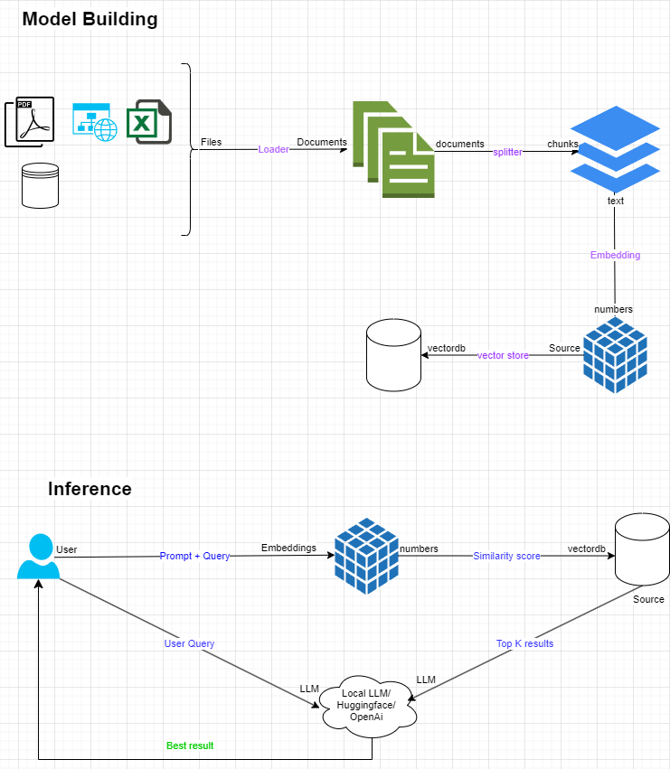

# local_GPT_chatbot
A custom chat which shall take documents and provide info on these documents

## Architecture of RAG

## Setup

### 1. Create a virtual environment

### 2. Activate virtual environment

### 3. Install the libraries

### 4. Create a .env file to store the API tokens

### 5. Run the file
streamlit run main.py

 - first enter the Query : when does the concert starts
 - The bot not able to answer this
 - Then load the csv file in the data folder
 - Then ask the same question

We can observe how the bot answer it as per the context

### Download model to local
huggingface-cli download  google/flan-t5-large pytorch_model.bin --local-dir ./model/ --local-dir-use-symlinks False
